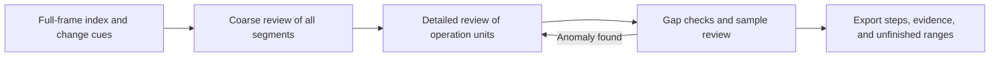

# video-operation-review

[简体中文](README.md) | English

**A layered review skill for software screen recordings: reconstruct operations and preserve video frames.**

Designed for step-by-step software tutorials covering modeling, programming, data processing, and similar tasks. It helps AI assistants with vision capabilities identify menu paths, selected objects, final parameter values, confirmation or cancellation, file handoffs, and visible results, producing operation records that can be checked and refined.

For example, if a video shows someone entering `0.20`, cancelling, then entering `0.02` and applying it, the review should distinguish the temporary input from the final value. Questions remain open when a button is unclear or an execution result is not shown.

> The scripts handle video indexing, evidence management, and record checks. The AI assistant interprets the operations by actually viewing the images.

## Features

- **Complete frame indexing.** Process the video sequentially and record original source frame numbers, original PTS timestamps, exact image identities, and change cues. Supports variable frame rates and nonzero start times.
- **Layered viewing.** Prepare segments and representative images for the entire video, then inspect original images, crops, and before-and-after states for key operations. Waiting, mouse movement, and flicker can be grouped when there is supporting evidence, without requiring detailed review of every distinct pixel state by default.
- **Operation reconstruction.** Record menus, objects, parameters, confirmation or cancellation, inputs and outputs, and visible results. Distinguish temporary inputs, final values, and unknown information.
- **Gap checks and local expansion.** Check for overlaps, state discontinuities, and missing information. Sample merged or lower-priority intervals, and expand the relevant window when an anomaly is found.
- **Subtitles and existing transcripts.** Accept SRT, VTT, embedded text subtitles, and transcript JSON with an explicit time base. Preserve the original text, optional translations, sources, offsets, and overlap warnings.
- **Persistent review progress.** Store indexes, evidence, viewing records, steps, and open questions in SQLite. Resume after a pause and reuse existing results.

## Workflow



The default mode is `layered`. For exhaustive review, explicitly select `coverage` and use the `strict` audit. Migrated review databases retain their previous strict mode and historical records.

Segment proposals are based on image changes and timeline features. The AI assistant must actually view the images to determine what each interval means and identify the operation steps.

## Requirements

- Python 3.10 or later.
- NumPy and Pillow; see [requirements.txt](requirements.txt).
- Accessible FFmpeg and ffprobe executables. FFmpeg must support `-fps_mode passthrough`.
- The host assistant used for semantic review must be able to read files, run local commands, and actually view images.

Validated on Windows with Python 3.10.11 and Python 3.12.10, using FFmpeg 8.1.2.

If you need to install the Python dependencies, use your own virtual environment:

```text
python -m pip install -r requirements.txt
```

## Getting started

### Ask an AI assistant to review a recording

After downloading or cloning this repository, you can ask an assistant with access to the directory:

> Follow the video-operation-review workflow in this directory's `SKILL.md` to review this software tutorial. Check for existing results first, then perform complete indexing, a coarse review of the full timeline, and detailed review of key operations. Deliver reproducible steps, key evidence, and unresolved questions. Report computational coverage, review coverage, and the number of source frames actually viewed separately.

The skill entry point is [SKILL.md](SKILL.md). The workflow can be used directly from the repository, without this project automatically changing the host's global configuration.

### Prepare evidence from the command line

Run the following commands from the repository root, replacing the input with your own video. Use a dedicated review directory for that video with `--work`.

```text
python scripts/review_video.py --help
python scripts/review_video.py scan ./input/tutorial.mp4 --work ./work/tutorial
python scripts/review_video.py plan --work ./work/tutorial
python scripts/review_video.py candidates --work ./work/tutorial
python scripts/review_video.py extract --candidates --work ./work/tutorial
```

These commands create the index, propose segments, and export images. The host then opens the images, records the views, fills in operation records, and imports them. For complete examples and field definitions, see:

- [Command examples](references/examples.md)
- [Layered review and sampling](references/layered-review.md)
- [Steps, evidence, and statistics](references/records.md)

### Subtitles and transcripts

```text
python scripts/review_video.py tracks --work ./work/tutorial
python scripts/review_video.py subtitles ./input/narration.srt --work ./work/tutorial --language zh-en --offset 0
python scripts/review_video.py transcript ./input/speech.json --work ./work/tutorial
```

Subtitles are aligned to the original video timeline using “subtitle time + explicit offset.” Transcript JSON must declare its time base.

Input and alignment of subtitles and existing transcripts are supported. Speech recognition, OCR inference, and automatic translation have not yet been integrated. See [Language, audio, and subtitles](references/language.md) for module boundaries and planned work.

### Validate and export

```text
python scripts/review_video.py validate --work ./work/tutorial
python scripts/review_video.py audit --work ./work/tutorial --summary
python scripts/review_video.py export --work ./work/tutorial
```

Use `validate --require-coverage` to check the complete-review requirements for the current mode. Partial results can be exported when information is insufficient, with the gaps preserved.

## Output

| File | Contents |
|---|---|
| `review.sqlite3` | Indexes, steps, evidence, viewing records, and review history |
| `layer-plan.json` | Segment proposals, representative images, and original state mappings |
| `review.json` | Structured steps, intervals, open questions, statistics, and audit information |
| `frames.jsonl` | Per-frame indexes and change metrics |
| `omission-audit.json` | Results of coverage, continuity, sampling, and review checks |
| `report.md` | Readable operation instructions, screenshots, and unresolved questions |
| `evidence/` | Original images, crops, and overview contact sheets exported as needed |

Input videos, review databases, and evidence may contain the user's own content. Keep them in their respective working directories.

## Understanding coverage statistics

The project records the following separately:

1. **Full-frame computational coverage:** which source frames the program has processed.
2. **Coarse review coverage:** which time intervals have an interpretation and representative evidence.
3. **Detailed review performed / completed:** which operations have had their key original images inspected, and which still have unresolved questions.
4. **Recorded visual views:** the number of distinct source frames registered after an image tool actually displayed them.

Original images, crops, enlarged views, and contact-sheet panels from the same source frame are deduplicated by source frame. Overview and original-resolution evidence are recorded at separate levels of detail.

Viewing records still need to be checked against actual tool calls. Passing an audit means the records meet the checking rules.

## Validation

The project currently includes **61 script tests**, covering the previous strict mode, layered intervals, evidence and review checks, cache recovery, VFR timing, and subtitle/transcript inputs. Once the dependencies are ready, run:

```text
python -X utf8 -m unittest discover -s scripts/tests -v
```

In one trial using a 32-frame synthetic tutorial, the layered workflow displayed 18 distinct source frames, compared with 32 in strict mode. Both recorded all 9 predefined visible-state checkpoints, with 0 errors in the final parameter value.

See [Validation notes](references/validation.md) for detailed results and limitations.

Maintenance and acceptance criteria are documented in [Layered acceptance](references/layered-acceptance.md) and [Processing methods](references/method.md).
