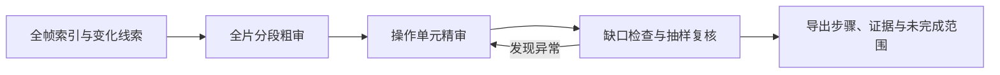

# video-operation-review

**面向软件操作录屏的分层审阅技能：还原操作步骤，保留画面。**

适用于建模、编程、数据处理等逐步演示的软件教程。它帮助具备视觉能力的 AI 助手从录屏中整理菜单入口、选中对象、最终参数、确认或取消、文件交接和可见结果，输出可以核对和继续完善的操作记录。

例如，视频里先输入 `0.20`，取消后重新输入 `0.02` 并应用，审阅结果应区分临时输入与最终值；看不清按钮或没有展示执行结果时，会保留疑问。

> 脚本负责视频索引、证据管理和记录检查；操作语义由 AI 助手实际查看图片后判断。

## 主要作用

- **完整帧索引。** 顺序处理视频，记录真实源帧号、原始 PTS 时间戳、精确画面身份和变化线索；支持可变帧率视频及非零起点。
- **分层查看。** 先准备全片分段和代表画面，再对关键操作查看原图、裁剪和前后状态。等待、鼠标移动和闪烁可以在有依据时合并说明，无需默认逐一精审每种像素状态。
- **恢复操作过程。** 记录菜单、对象、参数、确认或取消、输入输出及可见结果，区分临时输入、最终值与未知内容。
- **检查缺口并局部展开。** 检查重叠、状态跳变和缺失；对合并或低优先级区间抽查，发现异常后展开相关窗口。
- **接收字幕和已有转写。** 支持 SRT、VTT、内嵌文本字幕及带明确时间基准的转写 JSON；保留原文、可选译文、来源、偏移和重叠提示。
- **保留审阅进度。** 使用 SQLite 保存索引、证据、查看记录、步骤和疑点；支持暂停后继续，并复用已有结果。

## 工作流程



默认采用 `layered` 分层模式。需要穷尽复核时，可显式选择 `coverage` 并使用 `strict` 审计；旧审阅数据库迁移后保留原严格模式与历史记录。

分段建议由图像变化和时间线特征产生。ai助手需要实际看图，确定区间含义和操作步骤。

## 环境要求

- Python 3.10 或更新版本。
- NumPy、Pillow；依赖列表见 [requirements.txt](requirements.txt)。
- 可调用的 FFmpeg 与 ffprobe，FFmpeg 需支持 `-fps_mode passthrough`。
- 用于语义审阅的宿主助手需要能读取文件、执行本地命令，并实际查看图片。

已在 Windows 上验证 Python 3.10.11 与 Python 3.12.10，使用 FFmpeg 8.1.2。

如需安装 Python 依赖，建议在自己的虚拟环境中执行：

```text
python -m pip install -r requirements.txt
```


## 开始使用

### 让ai助手执行审阅

下载或克隆本仓库后，可以向能访问该目录的助手提出：

> 请按照本目录 `SKILL.md` 的 video-operation-review 流程审阅这段软件教程。先检查已有结果，再做完整索引、分层粗审和关键操作精审。交付可复现的步骤、关键证据及未解决项，分别报告计算覆盖、审阅覆盖和实际看图数量。

技能入口是 [SKILL.md](SKILL.md)。直接读取仓库即可使用其中的流程，无需本项目自动修改宿主的全局配置。

### 使用命令行准备证据

下面从仓库根目录运行，将输入文件替换为自己的视频。`--work` 应为这个视频专用的审阅目录。

```text
python scripts/review_video.py --help
python scripts/review_video.py scan ./input/tutorial.mp4 --work ./work/tutorial
python scripts/review_video.py plan --work ./work/tutorial
python scripts/review_video.py candidates --work ./work/tutorial
python scripts/review_video.py extract --candidates --work ./work/tutorial
```

这些命令完成索引、分段建议与图片导出。随后由宿主实际打开图片，再登记查看、填写操作记录并导入。完整操作示例和字段说明见：

- [命令示例](references/examples.md)
- [分层审阅与抽查](references/layered-review.md)
- [步骤、证据与统计字段](references/records.md)

### 字幕与转写

```text
python scripts/review_video.py tracks --work ./work/tutorial
python scripts/review_video.py subtitles ./input/narration.srt --work ./work/tutorial --language zh-en --offset 0
python scripts/review_video.py transcript ./input/speech.json --work ./work/tutorial
```

字幕按“字幕时间 + 显式偏移”对齐原始视频时间；转写 JSON 必须声明时间基准。

当前支持字幕和已有转写的输入与对齐；实际语音识别、OCR 推理和自动翻译尚未接入。模块边界及后续方案见 [语言、音频与字幕](references/language.md)。

### 校验与导出

```text
python scripts/review_video.py validate --work ./work/tutorial
python scripts/review_video.py audit --work ./work/tutorial --summary
python scripts/review_video.py export --work ./work/tutorial
```

需要检查当前模式的完整审阅条件时，使用 `validate --require-coverage`。信息不足时允许导出部分结果，但会保留缺口。

## 输出内容

| 文件 | 内容 |
|---|---|
| `review.sqlite3` | 索引、步骤、证据、查看记录与审阅历史 |
| `layer-plan.json` | 分段建议、代表画面和原始状态映射 |
| `review.json` | 结构化步骤、区间、疑点、统计与审计信息 |
| `frames.jsonl` | 逐帧索引和变化指标 |
| `omission-audit.json` | 覆盖、衔接、抽查和复核检查结果 |
| `report.md` | 便于阅读的操作说明、截图与未解决项 |
| `evidence/` | 按需导出的原图、裁剪和概览拼图 |

输入视频、审阅数据库和证据可能包含使用者自己的内容。它们应保存在各自工作目录。

## 如何理解覆盖统计

本项目分开记录：

1. **全帧计算覆盖**：程序处理过哪些源帧。
2. **粗审覆盖**：哪些时间区间已有含义说明和代表证据。
3. **已进行／已完成精审**：哪些操作已查看关键原图，哪些还保留未解决项。
4. **实际视觉查看登记**：图片工具真正展示后登记的不同源帧数。

同一源帧的原图、裁剪、放大和拼图面板按源帧去重；拼图与原尺寸证据的粒度分别记录。

查看登记仍需与真实工具调用核对。审计通过表示记录满足检查规则。

## 验证情况

当前包含 **61 项脚本测试**，覆盖旧严格模式、分层区间、证据与复核、缓存恢复、VFR 时间，以及字幕/转写输入等行为。可在准备好依赖后运行：

```text
python -X utf8 -m unittest discover -s scripts/tests -v
```

一次 32 帧合成教程试用中，分层方式实际显示了 18 个不同源帧，严格方式为 32 个；两者均记录了 9 个预设可见状态检查点，最终参数错误为 0。

详细结果与限制见 [验证说明](references/validation.md)。


维护与验收约定见 [分层验收](references/layered-acceptance.md) 和 [处理方法](references/method.md)。
