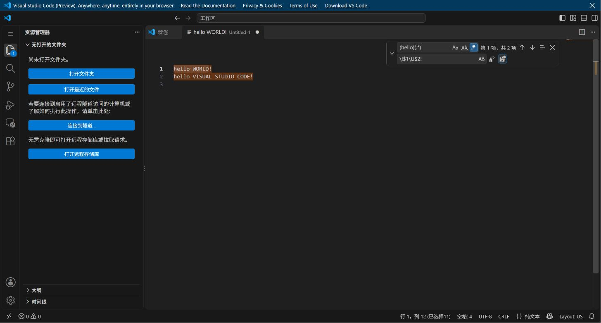

# 公开案例与独立试用 / Public cases and independent trial

下列三个历史案例来自2026-10-06使用RC.3进行的外部录屏试用，随RC.4提供公开摘要与可移植材料。当轮运行逻辑没有因此改变。

| 案例 | 输入 | 实际结果 | 审阅完成度 |
|---|---|---|---|
| case-vscode-01，多光标改词 | 11秒，44帧 | 六处lazy同步改成watchful，15个Tab保留 | 真实按键/软件环境未展示，保留未知；未通过整体门禁 |
| case-vscode-02，正则大小写替换 | 2.66秒，38帧 | 两行替换正确；只统一CRLF/LF后相同 | 正确记录与独立代理复核后通过门禁 |
| case-inkscape-01，语言选择 | 64.289秒，1903个解码帧 | 选择Tamil后退出，再切到已有Tamil窗口；不能证明新启动生效 | 585候选至少有概览或原图登记，507仍缺原图级；Q01/Q02保留 |

来源、固定URL、许可和SHA-256见[sources.json](sources.json)，当前数字见[results.json](results.json)。两个VS Code片段来自同一文档集合，不能当两个独立作者群体。原视频不随包提供；取得素材后先核对SHA-256，再按技能审阅。软件自身开源不等于视频许可，见[第三方声明](THIRD_PARTY_NOTICES.md)。

## 后续完整操作案例（2026-10-07）

另增[Python 异常处理案例](python-exception-20261007/README.md)：不同作者的 CC BY 3.0、153.581 秒录屏，从完整可见的既有脚本到两组运行结果。首次交付与仅按交付照做分别冻结后才打开参考；最终独立视觉复核通过当前门禁。原片未展示安装或建文件，普通 Python 复演不等同于 Spyder 界面复现；该例不用于宣称省时或真人可靠性。

## 一次新上下文代理试用

子代理仅收到准备说明、初始文本和操作说明，在新建未保存文档中操作；第一次输出冻结后由主任务核验。结果正确，仅CRLF/LF不同；任务阶段21秒、准备96秒、0次任务求助。准备有两次定位输入失败，停止后记录也有一次序列化失败，均已保留在脱敏摘要。主动/等待没有分别计量，后续取证、清理与核验不计入21秒。

[公开摘要](trial-observed/summary.json) · [原始与公开转录的哈希关系](trial-observed/provenance.json)

这张图是本项目在VS Code网页编辑器中的试用截图，不是从上游教程截取。界面中的名称、标识及商标属于各自权利人，不表示其为本项目背书。

## 复用材料

从[试用组织者入口](trial/README.md)开始。只给参与者准备说明、初始文本、操作说明和空白结果表；预期答案留给核验者。材料已修正成公开包内的相对路径，是发布时修订；不要把历史21秒试验称作修订后字节的直接UI验收。

原始工作账本和工具记录没有公开，摘要不能用于独立重算语义准确率。当前没有独立真人金标准、真人使用验收或无skill对照，不宣称总体省时。代理复核、记录有效与语义可信分别解释。

## English

These summaries describe three external-recording trials performed with RC.3 and packaged with RC.4. They do not represent a runtime algorithm change. See the pinned sources, hashes, licenses, and result JSON above; source videos are not bundled. The two VS Code clips belong to one documentation collection.

A later [Python exception-handling case](python-exception-20261007/README.md) uses a different creator's complete 153.581-second recording. Fresh authoring, delivery-only replay, and independent visual review are separately frozen and scoped; the reference is unsealed only after the first delivery and replay. Installation, file creation, native Spyder replay, human reliability, and time savings are not established.

Both editor operations were reproduced in a real browser editor. Only the regex case passed its complete review gate. Inkscape still has 507 candidates lacking native-level viewing and two unresolved source outcomes. A pre-existing translated window does not prove that the new preference took effect after restart.

One later fresh-context agent replay, with the expected answer withheld until output freeze, matched the text after line-ending normalization. Its task phase took 21 seconds and preparation 96 seconds; later evidence capture, cleanup, and verification were excluded. There was no separate active/waiting measurement or new browser profile. The screenshot documents that replay and does not imply upstream endorsement.

Use the [portable trial pack](trial/README.md) for further tests. It is a publication revision with corrected file references, not the exact material bytes used in the historical replay. Raw work ledgers and sessions remain local. These summaries establish neither independent human accuracy nor general reliability or time savings.
